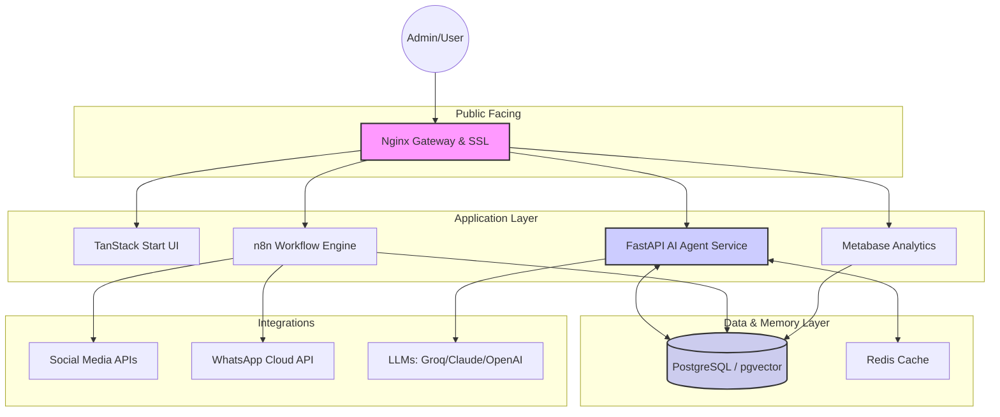

# Digital Marketing Hub & Agentic CRM

**The Unified AI-Native Operating System for Multi-Channel Marketing and Autonomous Sales.**

This repository delivers a production-ready, full-stack "Agentic" ecosystem. It combines high-speed social media automation with a deep, AI-managed Customer Relationship Management (CRM) layer. The system doesn't just automate tasks—it reason across your marketing data to proactively drive sales cycles and customer retention.

---

## 📂 File Index & Project Structure

```text
/
├── agents/                     # Backend: FastAPI + LangGraph AI Service
│   ├── agents/                 # LangGraph stateful agent definitions
│   │   ├── lead_scorer.py      # Lead qualification & task creation logic
│   │   ├── content_brief_gen.py# Performance-based strategy generation
│   │   ├── whatsapp_agent.py   # Conversational intent & sentiment analysis
│   │   ├── crm_*.py            # CRM specialized agents (G1, H1, H2, I1, J1)
│   │   └── utils.py            # Shared model selection (Groq/OpenAI/Anthropic)
│   ├── prompts/                # SYSTEM PROMPT REPOSITORY (The AI's brain)
│   ├── tools/                  # Agent tools (DB queries, search, etc.)
│   ├── utils/                  # DB connection & async session mgmt
│   └── main.py                 # FastAPI application entry & API routes
├── frontend/                   # Frontend: TanStack Start (React + Vite + Bun)
│   ├── src/                    # Application source
│   │   ├── lib/api/            # Server functions (Real DB & Agent bridges)
│   │   └── routes/             # TanStack Router definitions
│   └── agentic_crm_spec.html   # Detailed UI & Logic specification
├── n8n/                        # Automation: n8n Workflow Definitions
│   └── workflows/
│       ├── ingestion/          # Nightly metric pulls from social APIs
│       ├── publishing/         # Scheduled posting & formatting workflows
│       ├── lead-capture/       # Webhook listeners for forms, links, and DMs
│       ├── agent-calls/        # HTTP bridges between n8n and LangGraph
│       ├── crm/                # Internal pipeline & contact orchestration
│       └── analytics/          # Reporting & anomaly detection logic
├── infrastructure/             # DevOps & Database
│   ├── db/                     # SQL Migrations (Hub, CRM, Vector, Views)
│   └── nginx/                  # Reverse proxy & SSL configuration
├── start-dev.sh                # UNIFIED STARTUP SCRIPT (Local Dev)
├── docker-compose.yml          # Production & Infra Orchestration
└── ROADMAP.md                  # Implementation phase tracking
```

---

## 🏛️ System Architecture



---

## 🤖 AI Agent API Reference

The `agents/` service (Port 8000) provides 9 stateful reasoning endpoints. All require `X-API-Key` authentication.

### **Marketing Intelligence Agents**
*   `POST /agents/score-lead`: Analyzes `lead_interactions` to assign 0-100 scores and sales stages.
*   `POST /agents/generate-brief`: Scans top performing posts to output a structured creative brief.
*   `POST /agents/whatsapp-message`: Real-time intent/sentiment classification for inbound messaging.
*   `POST /agents/diagnose-anomaly`: Explains metric drops and recommends recovery actions.

### **CRM Orchestration Agents**
*   `POST /agents/crm/build-contact`: (G1) Merges leads into persistent contact profiles.
*   `POST /agents/crm/qualify-opportunity`: (H1) Runs BANT qualification on contacts.
*   `POST /agents/crm/draft-proposal`: (H2) Generates dynamic proposals based on conversation history.
*   `POST /agents/crm/next-best-action`: (I1) Determines the optimal follow-up channel and message.
*   `POST /agents/crm/retention-check`: (J1) Predicts churn probability and triggers interventions.

---

## ⚡ n8n Workflow Manifest (21 Workflows)

| Category | Workflows | Purpose |
|----------|-----------|---------|
| **Ingestion** | `ingest-{meta, linkedin, tiktok, youtube, whatsapp}-nightly` | Syncs engagement, reach, and follower metrics nightly. |
| **Publishing** | `publish-to-{meta, linkedin, tiktok, youtube, whatsapp}` | Handles scheduling, transformations, and status logs. |
| **Lead Capture** | `capture-leads-{link-click, form-submission, dm-response}` | Captures multi-channel signals into the PostgreSQL `leads` table. |
| **CRM** | `crm-contact-orchestrator`, `internal-pipeline-manager` | Manages the Lead → Contact transition and Pipeline stages. |
| **Agents** | `call-{lead-scorer, brief-generator, whatsapp-agent, anomaly-diagnostics}` | Bridge nodes that pass DB context to the LangGraph service. |
| **Analytics** | `anomaly-detection`, `weekly-report-generation` | Monitors 14-day baselines and distributes KPI PDFs. |

---

## 🗄️ Database Schema Overview

The system uses **PostgreSQL 16** with **pgvector** for hybrid relational/semantic storage.

### **Key Tables**
*   **Marketing:** `leads`, `posts`, `post_metrics`, `campaigns`, `content_briefs`.
*   **CRM:** `contacts`, `accounts`, `opportunities`, `proposals`, `tasks`, `lead_notes`.
*   **Intelligence:** `lifecycle_events` (Agent Memory), `knowledge_base` (Vector RAG).
*   **Compliance:** `gdpr_consents`, `whatsapp_optins`.

---

## 🛠️ Setup & Deployment

### **1. Rapid Startup (Local Dev)**
The stack is optimized for local development with one command:
```bash
./start-dev.sh
```
*Starts: Postgres, Redis, n8n (Docker) + Backend (Venv) + Frontend (Bun/Vite).*

### **2. Database Initialization**
Execute the SQL files in `infrastructure/db/` in this order:
1. `schema.sql` (Hub Foundations)
2. `crm_full_schema.sql` (CRM Extensions)
3. `vector_extension.sql` (Vector Memory)
4. `revenue_view.sql` (Attribution Bridge)

### **3. LLM Configuration**
Supported Providers (Set in `.env`):
*   `LLM_PROVIDER=groq`: Optimized for **Groq Free Tier** (Llama 3.1 70b).
*   `LLM_PROVIDER=anthropic`: Uses Claude 3.5 Sonnet.
*   `LLM_PROVIDER=openai`: Uses GPT-4o.

---

**Version**: 1.2.0 | **Last Updated**: June 2026 | **Status**: ALL CORE SPECS IMPLEMENTED ✓
