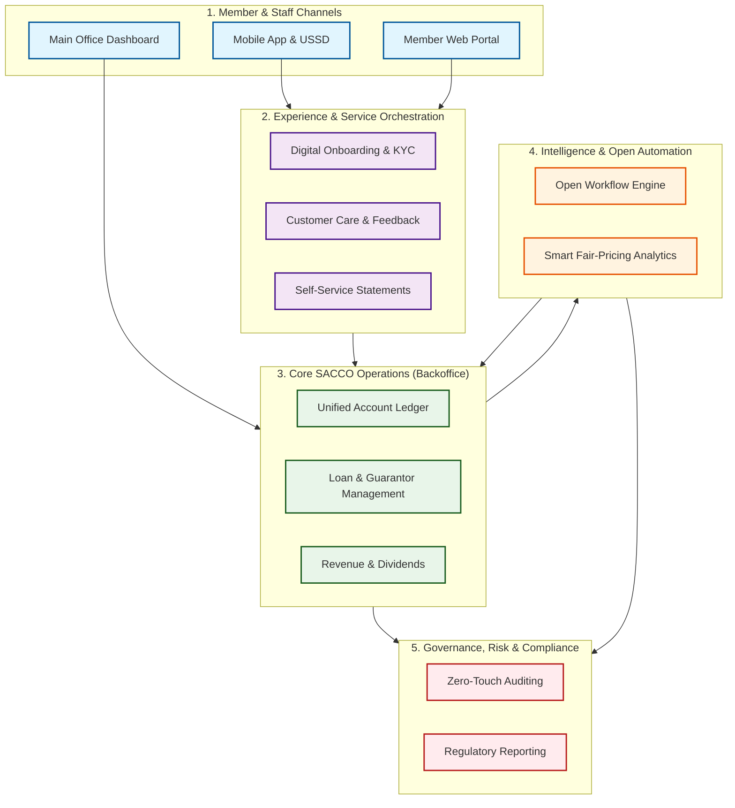

Here is the business-facing report formatted in Markdown, ready for you to copy, paste, and convert to PDF. 

I have translated the technical architecture into **business value propositions**, mapped directly to the strategic domains of the **Digital Capability Canvas**. I have also specifically framed your requirement for an open, vendor-neutral BPMN workflow engine as a major strategic advantage regarding **cost-avoidance and future-proofing**.

***

# **Digital Transformation Proposal: Next-Generation SACCO Management System**
**Prepared For:** [Lead's Name/Title]  
**Prepared By:** [Your Name/Title], Product Management & Enterprise Architecture  
**Date:** June 4, 2026  
**Subject:** Strategic Blueprint for a Unified, Audit-Ready, and Member-Centric SACCO Platform  

---

## **1. Executive Summary**
The landscape of Savings and Credit Cooperative Organizations (SACCOs) is rapidly evolving. Members now demand the same digital convenience they experience with retail banks, while regulatory bodies require unprecedented transparency and audit readiness. 

This proposal outlines a comprehensive, enterprise-grade SACCO Management System designed to unify the member experience with main office operations. By leveraging an **open-standards architecture**, this platform ensures **zero vendor lock-in**, guarantees fair and transparent loan pricing, and transforms auditing from a manual, stressful exercise into an automated, continuous business capability.

---

## **2. Strategic Business Capabilities**
Our solution is mapped directly to enterprise best practices (Digital Capability Canvas) to ensure every feature drives measurable business value.

### **A. Member Experience & 360° Organization**
*   **Capability:** *Manage Digital Experience Orchestration*
*   **Business Value:** We replace fragmented records with a unified 360-degree member profile. Members can onboard digitally, view real-time statements, and track their savings, share capital, and loan balances via Mobile, USSD, or Web. 
*   **The Guarantor Network:** Using advanced relationship mapping, the system visually organizes member guarantor networks, preventing "guarantor fatigue" and protecting members from over-leveraging their social capital.

### **B. Zero-Touch Auditing & Compliance**
*   **Capability:** *Manage Financial Audit & Enterprise Compliance*
*   **Business Value:** Auditing is no longer a year-end scramble. The system maintains an immutable, time-stamped ledger of every transaction, approval, and system change. External and internal auditors are provided with a secure, read-only portal to generate compliance reports instantly, drastically reducing audit fees and operational disruptions.

### **C. Fair, Data-Driven Pricing Engine**
*   **Capability:** *Manage Digital Intelligence & Revenue Management*
*   **Business Value:** Move away from arbitrary interest rates. Our "Smart Pricing Engine" analyzes the SACCO’s cost of funds, operational expenses, and member risk profiles to generate **fair, transparent loan pricing**. Members can see exactly how their rate is calculated, building immense trust and loyalty, while ensuring the SACCO maintains healthy profit margins.

### **D. Unified Main Office & Branch Operations**
*   **Capability:** *Manage Digital Backoffice & Enterprise Service Management*
*   **Business Value:** A single pane of glass for HQ and branch staff. Whether managing daily FOSA (banking) transactions, processing BOSA (back-office) dividend payouts, or managing procurement, the main office operates on a synchronized, real-time dashboard that eliminates data silos and branch-level discrepancies.

---

## **3. High-Level Business Architecture**
The following diagram illustrates how the system connects member interactions, core operations, and governance into a seamless ecosystem.



---

## **4. The Strategic Advantage: Open Standards & Zero Vendor Lock-In**
A critical pillar of this architecture is our approach to business process automation (e.g., loan approval workflows, audit escalations, member onboarding steps). 

Many legacy SACCO systems force organizations into expensive, proprietary vendor lock-in for workflow management. **We take a fundamentally different, future-proof approach:**

*   **Open Global Standards:** We utilize **BPMN 2.0** (Business Process Model and Notation), the global gold standard for process mapping. 
*   **Total Portability:** Because our workflows are built on open, standardized models rather than proprietary code, the SACCO **owns its business processes**. 
*   **Cost Avoidance:** If the SACCO wishes to upgrade, scale, or change underlying infrastructure providers in the future, your workflows, approval matrices, and audit trails can be migrated seamlessly without paying exorbitant vendor exit fees or rewriting business logic.
*   **Agility:** Business analysts can visually map and alter loan approval workflows using standard, open-source modeling tools, reducing reliance on expensive IT consultants for minor process changes.

---

## **5. Return on Investment (ROI) & Business Outcomes**

| Business Area | Current State (Traditional SACCO) | Future State (Proposed System) |
| :--- | :--- | :--- |
| **Auditing** | Weeks of manual document retrieval; high auditor fees. | **Days.** Automated evidence gathering; continuous compliance. |
| **Member Trust** | Opaque loan calculations; manual statement requests. | **High.** Transparent fair-pricing dashboards; instant digital statements. |
| **Risk Management** | Manual tracking of guarantors via spreadsheets. | **Automated.** Real-time network mapping prevents hidden risk exposure. |
| **IT Costs** | High annual licensing fees; trapped in vendor ecosystems. | **Optimized.** Open-standards architecture; zero vendor lock-in. |

---

## **6. Conclusion & Next Steps**
This platform is not just an IT upgrade; it is a strategic business enabler. By aligning our digital capabilities with member expectations and regulatory demands, the SACCO will position itself as a modern, transparent, and highly competitive financial cooperative.

**Recommended Next Steps:**
1.  **Process Discovery Workshop:** Map the SACCO’s current loan origination and audit workflows using open BPMN standards.
2.  **Pricing Model Calibration:** Define the parameters for the "Fair Pricing Engine" based on the SACCO's current cost-of-funds and risk appetite.
3.  **Proof of Concept (PoC):** Demonstrate the unified member portal and the zero-touch auditing dashboard.

---
*End of Report*

***

### 💡 *Note for PDF Conversion:*
*If your Markdown-to-PDF converter (like Obsidian, Typora, or a web tool) does not natively support Mermaid.js diagrams, you can easily copy the code block starting with ` ```mermaid ` and paste it into [Mermaid Live Editor](https://mermaid.live). From there, you can download the diagram as a PNG/SVG and insert it directly into your Word/PDF document under Section 3.*